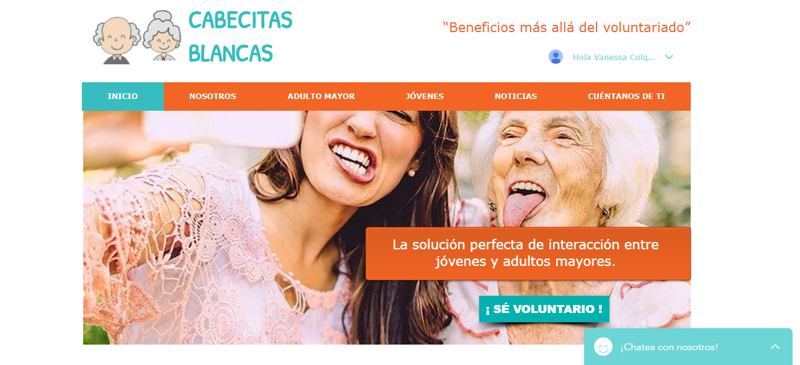
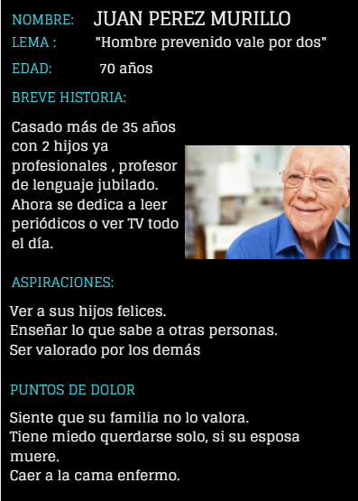
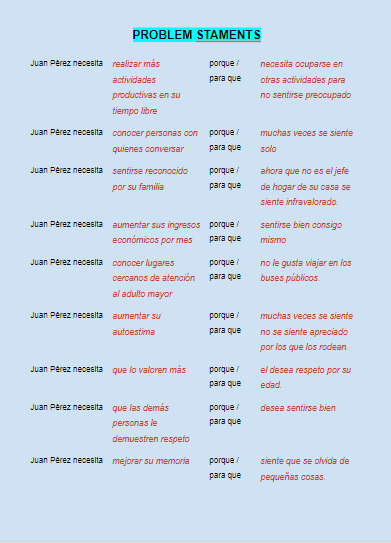
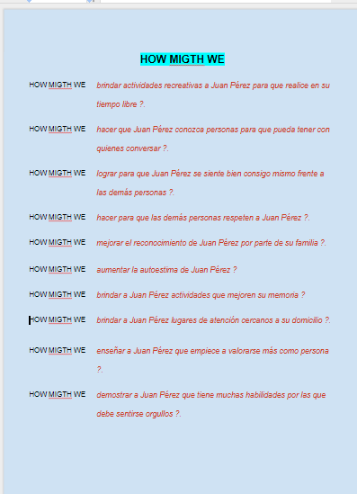
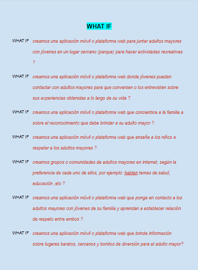
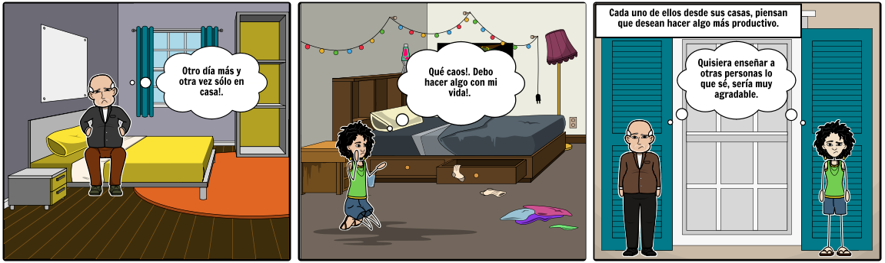
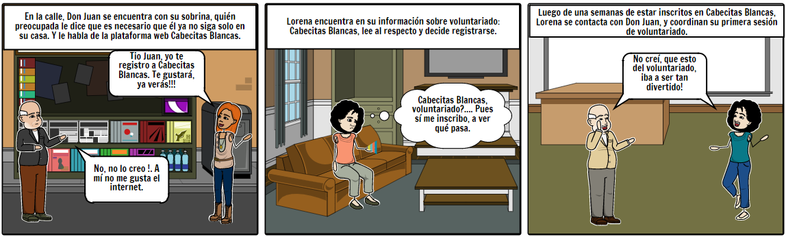
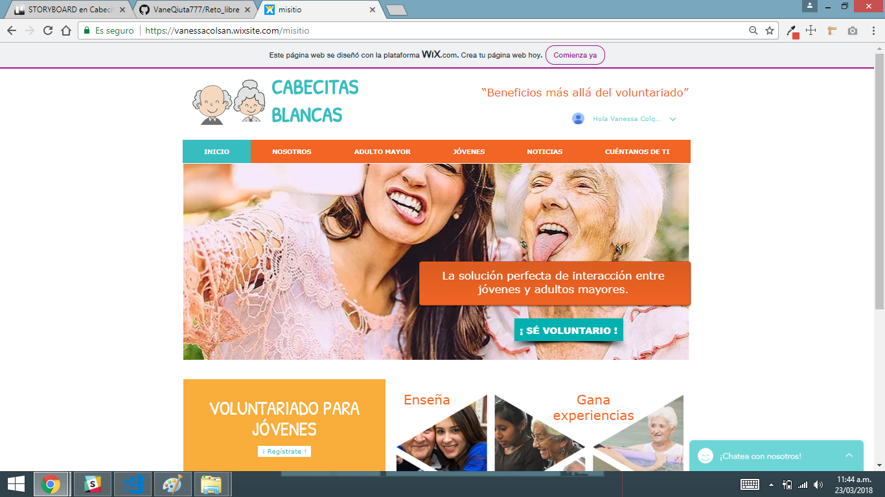

# 

# PLATAFORMA WEB DE CONTACTO ENTRE PERSONAS ADULTAS MAYORES Y JÓVENES

# 

* **Track:** _Especialización UX Design_
* **Curso:** _Aplica lo aprendido_
* **Unidad:** _Herramientas complementarias_
* **Alumna:** _Nombre:_

                * L. Vanessa Colqui Santos

***

## Reto

### Reto Libre

Durante este sprint y durante lo que queda del bootcamp deberás trabajar individualmente en diseñar o rediseñar un producto digital.

Si tienes una idea de un producto que te gustaría probar, lo podrás hacer. Podrás identificar y conocer a tus usuarios y hacer las pruebas necesarias para poder validar tu idea.

Por otro lado, si es que se te hace difícil pensar en una idea para un producto podrías escoger un producto que ya existe pero que crees que necesita mejorar como un portal de venta de entradas para conciertos, un portal de venta de flores o un ecommerce.

### Objetivo del reto

* Aplicar todo lo aprendido hasta ahora (UX) y demostrar todo el potencial.

***

## Consideraciones

* Este reto fue realizado individualmente.

* Dentro de este archivo `README.md` está todo el desarrollo del trabajo, el proceso de investigación, la solución del reto, conclusiones y feedbacks recibidos.

* Dentro de la carpeta `assets` se encuentra la carpeta `img` y `docs` donde se puede encontrar los archivos utilizados en el reto.

## Desarrollo del reto

1) Se analizó el reto, por lo que se realizó una investigación previa del área a desarrollar.
2) Se determina el área de salud, y el tema cuidado de los adultos mayores para trabajar como proyecto.
3) Se investiga las aplicaciones móviles existentes en el mercado para cuidado del adulto mayor
4) Se realiza el BMC de nuestro proyecto.
5) Se realiza un Plan de Research.
6) Se realiza encuestas y entrevistas a los stakeholders.

 **Link de Google Drive:**

[Carpeta de trabajo en Google Drive](https://drive.google.com/drive/u/0/folders/1SK12oIfkxzoclgjWt3Pg_hF47w_Pucyu).

***

## Investigación previa

#### Plan de Research

[Documento de Google](https://docs.google.com/document/d/1qJ8xozrXhbVfY6hoM4u3IRSmkuIHUJJLVNzI4ZXnLUQ/edit?usp=drive_web&ouid=101839907055651696098).

#### Plan de Investigación "Plataforma web que contacta al Adulto Mayor voluntario con personas jóvenes voluntarios"

Las aplicaciones móviles que brindan servicios orientados al público adulto mayor no son numerosas. Es un sector de la población que está poco atendido y que sin embargo cuenta con un gran potencial, lo cual constituye una gran oportunidad de negocios al tener un gran público potencial. En el Perú no existen aplicaciones similares,
Las aplicaciones existentes han sido desarrolladas y promocionadas en el extranjero. Se observa que el uso de dispositivos móviles es cada vez más común en la población en general, y también el acceso a Internet está cada vez más extendido. Por otro lado, los resultados de los últimos censos en nuestro país nos indican que el sector poblacional de adultos mayores se está incrementando en un porcentaje mayor incluso que otros grupos etarios poblacionales. 
Cada vez más se potencia más la utilización de las nuevas tecnologías como instrumento de ayuda, asistencia sanitaria y de primeros auxilios a los mayores como aparatos de localización y solicitud de ayuda inmediata, servicios de atención sanitaria y de vigilancia.
Cada vez son más los fabricantes de tecnología que deciden lanzar dispositivos para mayores. Alcatel, por ejemplo, cuenta con modelos de teléfonos móviles que se caracterizan por tener una pantalla mediana y botones bastante grandes. Además, poseen funciones básicas para llamar, escribir SMS o tomar fotos. Además, actualmente se están desarrollando programas dirigidos a adultos mayores como GPS para pacientes con deterioro cognitivo, calendario de citas, atención de emergencias, monitor de medicación y rehabilitación cognitiva.

##### Claves para acerca la tecnología a los adultos mayores

* Que vean utilidad en ella

Si estar conectados desde su Smartphone les sirve para estar comunicados con sus familiares y amigos, o para informarse sobre el tiempo y las noticias es más sencillo que encuentre interés en aprender.

* Empezar con algo sencillo y manejable

Empezar por los servicios y dispositivos que les sean de más utilidad y dejar para más adelante lo más complejos.

* Encontrar temáticas que les gusten 

Será más fácil convencerles por ámbitos que despierten su interés y, sobre todo, si descubren que con par de toques a la pantalla aparece lo que quieren ver.

* Constatar los progresos propios

Ir poco a poco, con paciencia, y poniendo de relieve los éxitos conseguidos animándole a no desesperarse y abandonar la práctica.

* Beneficios de acercar la tecnología a los adultos mayores

Al aprender nuevos conceptos se favorece la conexión entre neuronas, lo que aumenta la capacidad cognitiva (memoria, atención y concentración) favoreciendo su agilidad mental.

Es una vía para mantener contacto con sus seres queridos.
Internet es una fuente inagotable de información, por medio de este esté podrá tener más acceso a la información médica.
La tecnología le permite agilizar cualquier proceso médico como resultados de cualquier análisis.
Ante un mundo en constante desarrollo y una amplia oferta en cuanto a tecnología, es normal que las personas de la tercera edad cada vez muestran más interés por aprender sobre el uso de los dispositivos digitales.
Internet puede propiciar la interacción entre adultos mayores
La relación intergeneracional, aprender sin límite de edad, entro otras muchas cosas. Todos estos aspectos pueden ayudan a abrirles las puertas, tanto en el campo de los conocimientos como el de las relaciones. Pero, aunque cada vez son más los adultos que se suben al carro de las nuevas tecnologías, aún queda mucho camino por delante.

##### Resultado de Investigaciones anteriores

* Medisafe: es algo más que un pastillero digital. Además de poder registrar todas las pastillas que debes tomar, te avisa a la hora que te toca cada una, por medio de una llamada, un email o un mensaje, como tu prefieras. Si eres despistado, esta es tu aplicación, ya que también puede avisar a tu familia si no te has tomado la medicina adecuada.

* Alerhta: esta app te resultará de gran ayuda para prevenir la hipertensión o para  solucionarla si ya lo padeces. A través de la aplicación móvil puedes hacer un seguimiento de tus mediciones, apuntar todas las indicaciones que te ha dado el médico, ver la evolución de tu presión arterial desde que comenzaste a tomar la medicación, etcétera.

* Fit Brains Trainer: aunque cualquier sudoku o crucigrama te puede valer para mantener la mente ágil y despierta, esta app está diseñada de forma específica para que las personas mayores mantengan su memoria, agilicen la mente, y aumenten su capacidad de concentración, entre otros beneficios. Lo podrás conseguir a través de 360 sesiones de entrenamiento.

* Lumosity: es un programa de entrenamiento cerebral diseñado por científicos. Esta aplicación combina más de 25 juegos cognitivos en un programa de entrenamiento diario que pone a prueba el cerebro. A través de esta aplicación, y según los diferentes apartados que la componen -como ser: memoria, atención, velocidad, flexibilidad y resolución de problemas-, el adulto mayor puede elegir qué es lo que quiere trabajar y desarrollar. De esta forma, mediante un programa fijado según necesidades y objetivos personalizados, se puede trabajar cada uno los aspectos que se quiera mejorar de manera fácil y sencilla.

* Aliver.Life: Una plataforma digital que promueve la ayuda mutua entre adultos mayores y jóvenes fue presentada en Panamá con el propósito de obtener servicios, generar ingresos y acercar a generaciones que comparten afines tecnológicos. Una herramienta que consiste en una página web y aplicación móvil.

##### HIPÓTESIS

Si los adultos mayores logran compartir sus experiencias y/o conocimientos con otras personas aumentan su posicionamiento social.

##### OBJETIVOS COMERCIALES

Lograr que el producto a desarrollar genere ganancias.

##### OBJETIVOS DE LA INVESTIGACIÓN

Identificar las necesidades y/o problemas de los adultos mayores.
Priorizar las necesidades y/o problemas de los adultos mayores.

##### METODOLOGIA DE LA INVESTIGACIÓN

La metodología a usar mediante el framework Design Thinking, para crear productos y servicios que tiendan a satisfacer en mejor manera las necesidades de los usuarios haciéndolos parte activa del proceso de creación.
También la metodología Agile, la cual basa su desarrollo en un ciclo iterativo , en el que las necesidades y soluciones evolucionan a través de la colaboración entre los diferentes equipos involucrados en el proyecto.

Perfil del participante:
Personas adultos mayores de 60 años de edad.
Jóvenes voluntarios mayores de 18 años.

##### ENTREGABLES

A lo largo de la investigación se hará participar a todo el equipo, todos deben estar enterados de cómo está yendo el proyecto desde su inicio hasta el final.
Para mantener un orden y objetivos claros, se proponen estos entregables:
1ra semana: Entrega del plan de research.
2da semana: Entrega del producto final, previo testing.

#### Business Model Canvas

 .

#### Nuestros de Stakeholders

* Las personas adultos mayores
* CEO.
* Jefe de innovación.
* Equipo digital:
      - Ux-designer
      - UI-designer
      - Front-end developer
      - Back-end developer

***

## Etapas DCU (Diseño Centrado en el Usuario):

## A. Descubrimiento e Investigación

### Actividades:

   #### 1.- Entrevista con usuarios y stakeholders

   [Análisis de entrevistas personales](assets/docs/entrevista.docx).

   #### 2.-  Encuestas a usuarios

   [Formulario de Google](https://docs.google.com/forms/d/10OYTpBoDRWJ9j_1iVh5lpzRHbB5cik2FIBogtNSHreE/edit#responses).

   #### Resultados

   [Análisis de encuesta](https://docs.google.com/document/d/1MsYcHzP6cH8MWroWDbOzpT8-2mLE_Jfcsn3wi5t0ge8/edit).

   #### 3.- Investigación por internet (aplicaciones y/o plataformas web para personas adultas mayores)
   
   - Se identificaron los temas a investigar en internet: área de salud, social, económica del adulto mayor en el Perú.

 ## B. Síntesis y Definición

   ### Actividades:

   #### 1.- Definición del problema: Diagrama de afinidad.

   Se utilizó el diagrama de afinidad, a través los siguientes pasos:
   - Paso 1.- En posits se colocó los comentarios( los problemas que identifican, los servicios que desearían recibir, etc) tal cual como los usuarios lo mencionaron sin interpretaciones ni deducciones; dichos usuarios fueron adultos mayores de las entrevistas y/o encuestas.
   
   - Paso 2.-  Se agrupó  los posits por temas.

   .

   #### 3.- Benchmarking.

   .

   #### 5.- Definición de los User personas.

   
   

   #### 6.- Definición de los Problems Statements.

  .

   [Problem staments](https://docs.google.com/document/d/1UmWc-Mgjoa6kdpr13gA9Yv8llhqQebM9fMR5QlEWtC8/edit)

   #### 7.- Definición de los HOW MIGHT WE?

  .

   [HMW](https://docs.google.com/document/d/1tLpqpDCF6Iaq_v62fLHcUmXP0xOB417B72EFpDV6r2s/edit)
   
   #### 8.- Definición de los WHAT IF?

  .

   [What If](https://docs.google.com/document/d/17eDSRrqpgh8rGU1k64tspuguu3ap74g6mS1kKfCdhng/edit)

   #### 9.- Definición de FEATURE LIST.

   

 ## C. Ideación

   #### 1.- Realización del Storyboard.

   
   

 ## D. Prototipado

   

 ## E. Testing

   * Testing 01: Sra. Rosa
     - Entiendo que es una página para conocer jóvenes con quienes conversar.
     - Me gustaría que me ayuden a pertenecer a la página.
     - El video al inicio me confunde.
     - Los colores son llamativos, me gustan.

   * Testing 02: Srta. Beatriz
    - En términos de color me gusta el celeste, pero el anaranjado no sé si sea su mejor par.
    - En términos de flujo de vistas, me parece que está bastante intuitivo, siento que es súper orgánica.
    - Entiendo para qué sirve cada botón, y no se siente muy cargada o sea, tiene la cantidad de información necesaria.

  * Testing 03: Joven Zaulho
    - Es interesante.
    - Es muy básico.
    - Le quitaría el video antes de ingresar a la página.

  * Testing 04: Sra. Ivonne
    - Me gusta que pueda conocer lo que los demás pueden enseñar.
    - Sería bueno para nosotros las personas mayores, para tener con quienes conversar.
    - Es fácil, pero para ingresar me deben ayudar.

   * Testing 05: Sr. Diócenes
    - No entiendo, el video al inicio, me confunde.
    - A mí me gustaria aprender a usar mejor el celular, aunque yo uso uno muy básico.

  #### Resultado final del Prototipo

  [Cabecitas Blancas](https://vanessacolsan.wixsite.com/misitio)
